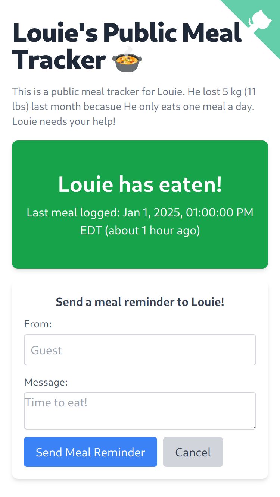
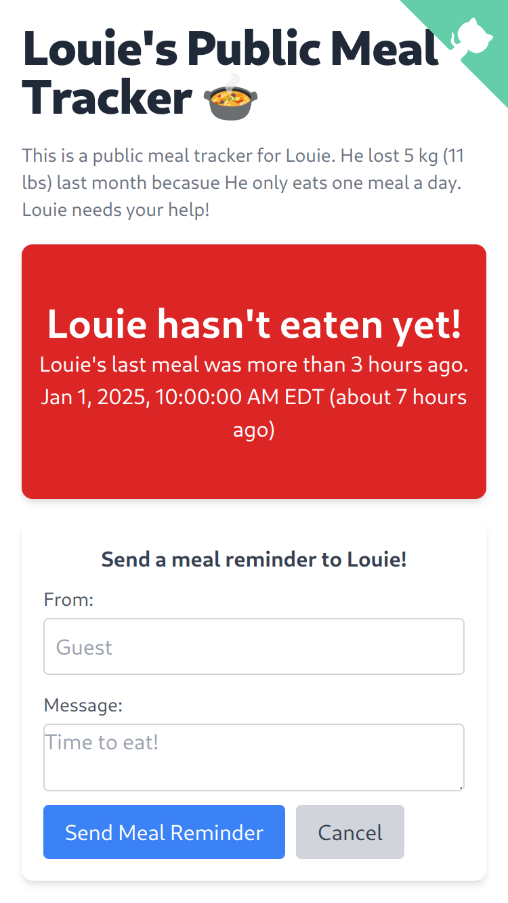

Public Meal Tracker
===================


<div align="center">
A public meal tracker for anyone who needs.
</div>


Introduction
------------
| You Ate | Not yet |
| :--: | :--: |
|  |  |

This is an SPA that lets you publish your meal status and allows others to remind you to eat via a Telegram bot.

Prerequesites
-------------

- uv
- node

Setup
-----

### From source

```
git clone https://github.com/mlouielu/public-meal-tracker
cd public-meal-tracker

# Setup backend
uv sync
source .venv/bin/activate

# Setup frontend
cd frontend
npm install
```

### Backend Environment Variables

1. Copy `backend/.env.example` to `backend/.env`
2. Setup environment variables as the following.

### Google OAuth

See: [Setting up OAuth 2.0 - API Console Help](https://support.google.com/googleapi/answer/6158849), please select "Web application" for Application type.

Authorized JavaScript origins:

- For localhost testing:
  - http://localhost:3000
- For production:
  - your web URL

Authorized redirect URIs:

- For localhost testing:
  - http://localhost:5000/api/auth/login/callback
- For production
  - your web URL/api/auth/login/callback


After setting it up, copy your client ID and client secret into `backend/.env`.

For `ALLOWED_EMAIL`, change to your desired email address that you allowed to log the meal.

### Telegram Bot

1. First, [obtain your bot token](https://core.telegram.org/bots/tutorial#obtain-your-bot-token) from [@BotFather](https://t.me/botfather).

Your token will look something like this: `4839574812:AAFD39kkdpWt3ywyRZergyOLMaJhac60qc`, DO NOT SHARE IT WITH ANYONE.

2. Find your Chat ID

Start a conversation with your new bot, send any message to it, and then get your chat ID by:

```bash
$ curl https://api.telegram.org/botYOUR_TOKEN/getUpdates | jq | grep "id" | head -n3 | tail -1
  % Total    % Received % Xferd  Average Speed   Time    Time     Time  Current
                                 Dload  Upload   Total   Spent    Left  Speed
100   333  100   333    0     0    937      0 --:--:-- --:--:-- --:--:--   938
          "id": 112233445,
```

Replace YOUR_TOKEN to the bot token, don't forget `bot` prefix. If you don't have curl, you can open it from your browser.

After setting it up, copy your bot token and chat ID into `backend/.env`.


Run It Locally
--------------

### Backend

Assume you are in the virtual environment, if not, `source .venv/bin/activate`.

Run the following:

```
python backend/app.py
```

### Frontend

Run the following:

```
cd frontend
npm start
```

### Browser

After you run `npm start`, your browser should automatically open the page, if not, open `localhost:3000` for the tracker.

Deployment
----------
